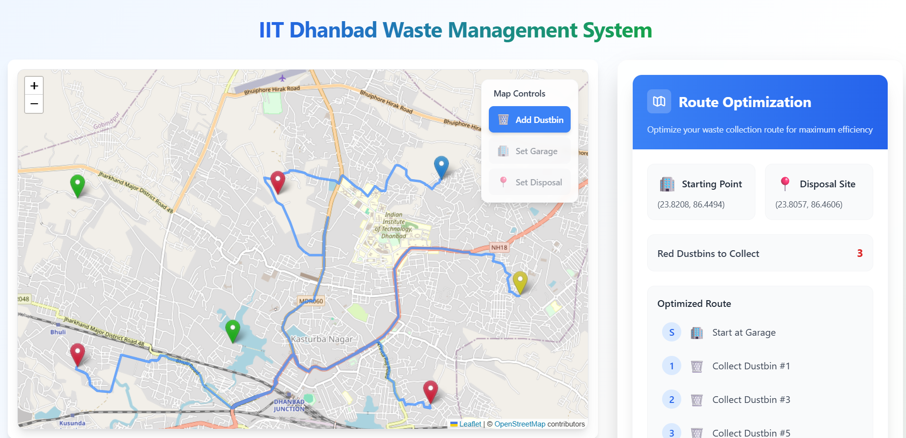
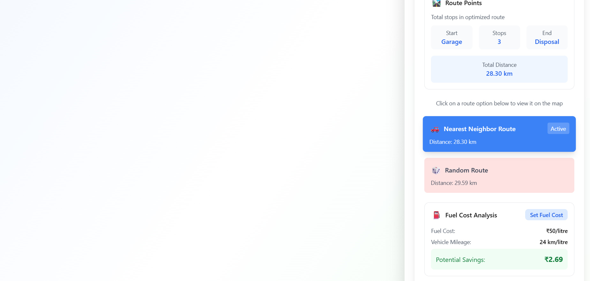

# 🚛 IoT-Based Solid Waste Management System
This project provides an intelligent, IoT-enabled solution for efficient solid waste collection. It is designed to optimize waste collection routes and reduce fuel consumption by monitoring the status of dustbins in real-time.

# 🛠️ Key Features
User Input for Infrastructure: Users can input the locations of dustbins, garages, and disposal sites.

Smart Threshold Trigger: When the number of filled dustbins crosses a predefined threshold (e.g., 3), the system automatically initiates a waste collection process.

IoT-Enabled Monitoring: Each dustbin is equipped with sensors that notify the system when it is full.

Optimized Route Generation: Uses optimization algorithms (e.g., Dijkstra, Genetic Algorithms) to calculate the most efficient route for waste collection trucks.

Traditional vs. Smart Routing: Compares the optimized route with a traditional fixed route and calculates the fuel saved using the intelligent system.

Data Visualization: Displays locations and routes on an interactive map.

# 📈 Benefits
Reduced fuel consumption and operational cost

Faster and more efficient waste collection

Scalable to large urban or industrial areas

Environmentally friendly with less carbon emission

# 🖼️ Sample Output

